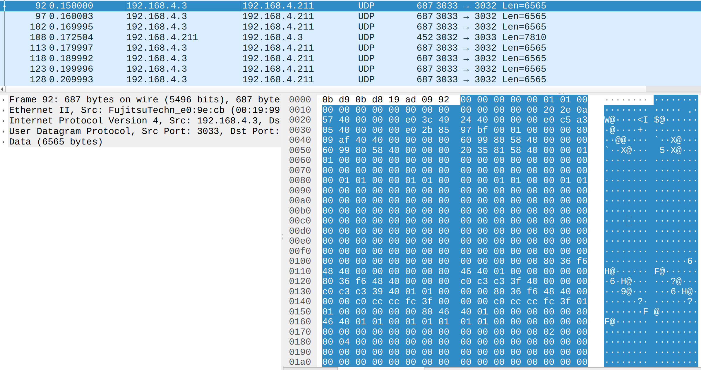
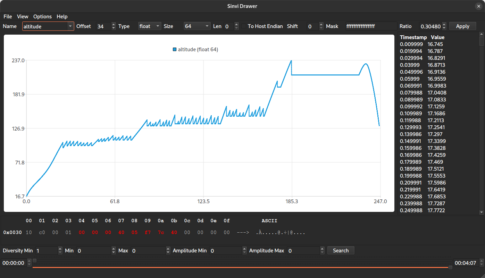

# Sinvi
 Reverse engineering toolbox for fixed size protocol messages.
 
 Allows to switch from binary manual sinking

to visual physical values interpretation

With the possibility to:
 - Change data interpretation type
 - Set data size (8, 16, 32, 64) or custom for strings
 - Set mask, shift and conversion ratio
 - Use bookmarks from/to configuration file
 - specify endianity 
